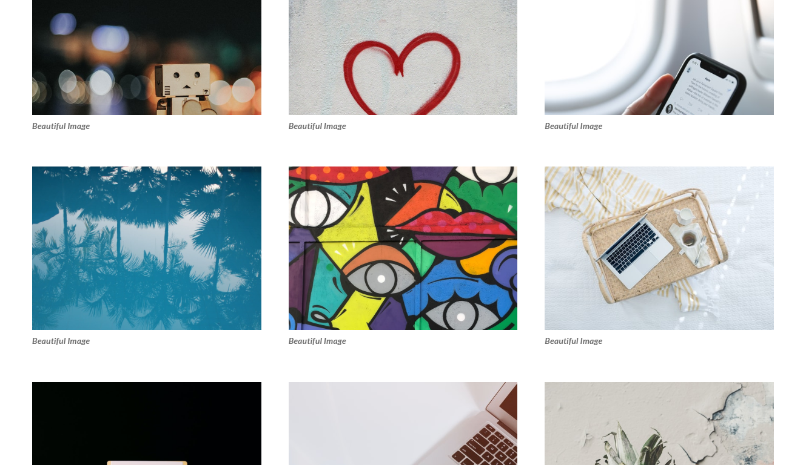

# Photo Galleries

> A collection of pure CSS3 galleries. Made using VueJS and CSS, the galleries in this project are:

- Masonry
- No Gutter Masonry
- Grid
- No Gutter Grid
- Hexagon Grid
- Row Masonry

All the galleries in this project can be coppied, but the copyright notice in all the files must be maintained, as states the LICENSE. All images provided by Unsplash. Check out pictures of the project:

## Row Masonry


## Masonry:


## Grid:



## No Gutter Masonry


## Using

If you don't want to download the project, you can access the files through GitHub and copy the css inside the style tag. The html is inside the <template> tag. Just remove the v-for and the :key attributes from the inner tag of the gallery wrapper and copy that tag many times. Like so:

```html
<div class="grid-wrapper">
  <div class="grid">
    <div class="block">
      <div class="image-mask">
        
      </div>
      <p class="description">Beautiful Image</p>
    </div>
    <div class="block">
      <div class="image-mask">
        
      </div>
      <p class="description">Beautiful Image</p>
    </div>
    ...
  </div>
</div>
```

If you want to download the entire project. Follow the following steps. After downloading the project, you can go into a console and cd the main project folder:

```sh
cd photo-galleries
```

And, then:

```sh
npm run dev
```

## Meta

Creator: Eduardo Migueis

Distributed under the APACHE 2.0 LICENSE. See `LICENSE` for more informaton.

[https://github.com/edumigueis/photo-galleries](https://github.com/edumigueis)
